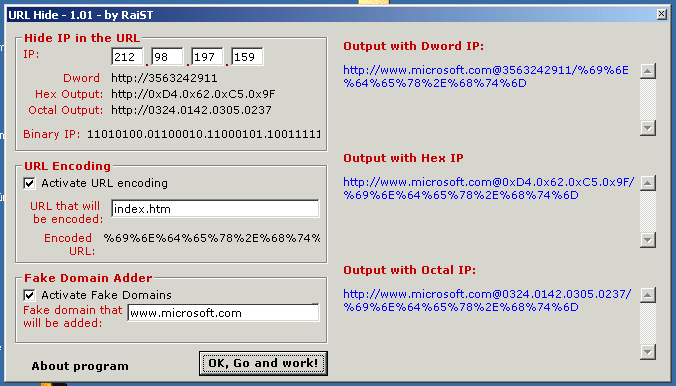



## URL Hide

### Description

URL Hide is a program for hiding html links with a easy way. 

There is 2 types of hiding the link: 

- Hiding the IP address of the domain 

- Hiding the text after the domain 

IP address can be converted to: 

-dword format 

-hex format 

-octal format 

-and binary format 

Text after the url can be encoded. 

Also you can add a fake domain. 

Look the code for more information. 

Note: This url encoding and hiding functions are easy to crack. They must be used for simple hiding purposes 
 
### More Info
 
encoded urls and hidden ip's works with only Internet Explorer 5.5 and below. They do not work with IE6 

             |
---                |---
**Submitted On**   |2002-09-12 17:29:56
**By**             |[Huseyin  Uslu](https://github.com/Planet-Source-Code/PSCIndex/blob/master/ByAuthor/huseyin-uslu.md)
**Level**          |Intermediate
**User Rating**    |4.8 (24 globes from 5 users)
**Compatibility**  |VB 6\.0
**Category**       |[Complete Applications](https://github.com/Planet-Source-Code/PSCIndex/blob/master/ByCategory/complete-applications__1-27.md)
**World**          |[Visual Basic](https://github.com/Planet-Source-Code/PSCIndex/blob/master/ByWorld/visual-basic.md)
**Archive File**   |[URL\_Hide1301969122002\.zip](https://github.com/Planet-Source-Code/huseyin-uslu-url-hide__1-38917/archive/master.zip)

